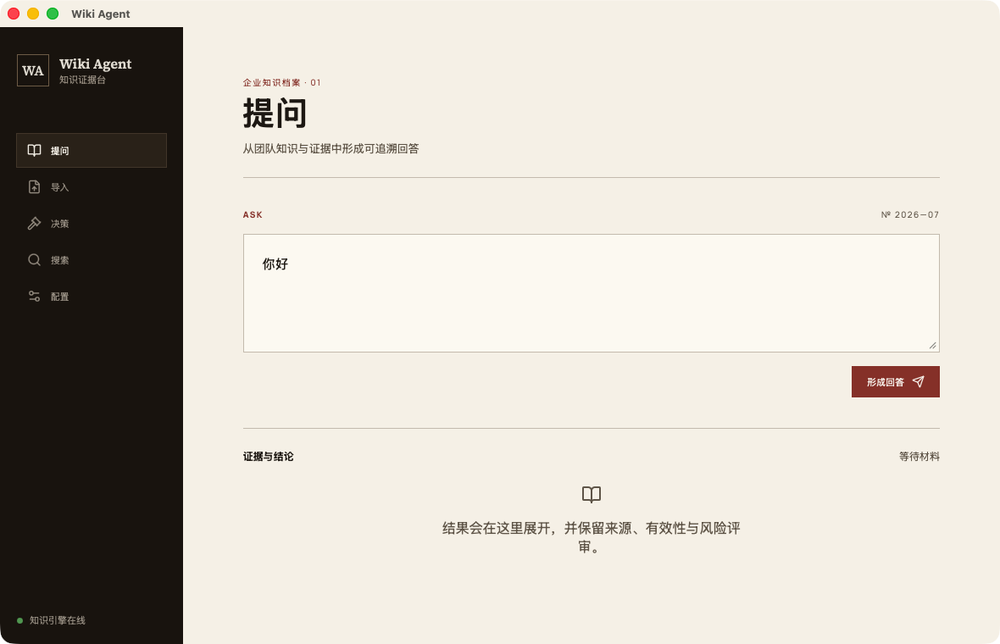

# wiki-agent

企业知识 Agent：导入文档 → AI 自动把知识学进图谱 → 提问回答（带证据）→ 决策可查 → 可联网补充。

## 界面预览



## 目标能力（需求确认版）

1. 可配置 LLM（OpenAI 兼容端点，默认 DeepSeek）
2. 能导入文档（md/pdf/docx/txt，统一转纯文本）
3. 能查看决策（图谱中 Decision/Rule/Risk/Experience 实体列表）
4. 能 Web Search（SearXNG，URL 可配置，默认公共实例）
5. 能提问（LangGraph 工作流：检索→推理→评审→回写）
6. AI 自动学习知识点（导入/问答后自动抽取进 Graphiti，含时序失效）

## 前置结论（已验证，勿重复踩坑）

**许可证**：llm_wiki 是 **GPLv3**——可二开但衍生作品分发须同许可开源。决策：**只借架构思路，不抄代码**，本项目许可证可自选。

**llm_wiki 值得吸收的 5 个设计**（调研报告在会话中，参考仓库 `temp/llm_wiki_ref/`）：

1. 三层架构：`raw/`（原文不可变）→ 知识层（AI 维护）→ `schema.md`/`purpose.md` 即配置（知识类型用文本约定，不写死数据模型）
2. 两步 Ingest：先分析（找与现有知识的连接/矛盾）再生成，质量好于一步到位
3. 溯源三件套：`sources[]` 回链、SHA256 增量跳过、同主题合并
4. Review 队列：AI 标记存疑项 → 人工确认 → 自动回灌（HITL 闭环）
5. Deep Research 闭环：预生成搜索词 → 搜索 → 综合 → 自动再 ingest（"自动学知识"范式）

**不学**：Tauri/Rust 桌面壳、多格式深度解析（用 pypdf/python-docx/markitdown 即可）、LLM 输出容错机（用结构化输出+Graphiti 受控抽取替代）、自建多 LLM 适配层（用 LangChain 抽象）。

## 技术底座（已跑通验证）

已完成并验证的 demo：`temp/langgraph-graphiti-expert/`（详见其 README），直接作为本项目的内核迁移来源：

- **图库**：FalkorDB（redis 8.8.0 源码编译 + `bin/falkordb.so` 模块，无 Docker 方案；本机 brew 已坏勿用）
- **记忆层**：graphiti-core 0.29.2 + FalkorDriver；自定义实体 Decision/Rule/Risk/Experience
- **工作流**：LangGraph 四节点 + AsyncSqliteSaver checkpoint
- **LLM**：DeepSeek `deepseek-chat`（OpenAI 兼容，`/v1`；必须用此名走非推理模式）+ 本地 fastembed `BAAI/bge-small-zh-v1.5`（512 维，DeepSeek 无 embedding API）

**graphiti 集成四坑**（demo 已解，代码直接搬）：

1. `EMBEDDING_DIM=512` 必须先于 graphiti_core 导入设置
2. `OpenAIGenericClient` 必须传 `structured_output_mode='json_object'`（DeepSeek 不支持 json_schema）
3. DeepSeek 抽取会把自定义属性包 `properties` dict，FalkorDB 拒收嵌套 map → 写入前拍平 shim（见 demo `src/memory.py`）
4. **写入按 group_id 分图，检索走 driver 默认图** → `FalkorDriver(database)` 必须等于 `GROUP_ID`，否则新进程查空图

## 建议架构（待用户确认后实施）

```
wiki-agent/
├── raw/                    # 原始文档（不可变，source of truth）
├── schema.md               # 知识类型与 frontmatter 约定（文本即配置）
├── purpose.md              # 项目目标，注入所有 prompt
├── src/
│   ├── config.py           # LLM/图库/搜索配置（.env）
│   ├── memory.py           # Graphiti 封装（从 demo 迁移，含全部 shim）
│   ├── embedder.py         # fastembed 本地 embedding（从 demo 迁移）
│   ├── ingest.py           # 文档导入：解析→两步(分析/抽取)→入库→溯源
│   ├── search_web.py       # SearXNG 客户端
│   ├── agent_graph.py      # LangGraph 工作流（含 Knowledge Router 节点）
│   └── decisions.py        # 决策/规则查询 API
├── server.py               # FastAPI：/ask /ingest /decisions /search + 聊天页
├── demo.py                 # CLI
└── checkpoints.db
```

**实施顺序**：① git init + 骨架 + 迁移 demo 内核 → ② 文档导入管线 → ③ 决策查看 + Web 搜索 → ④ 自动学习（reflect + review 闭环）→ ⑤ 端到端验证

## 环境操作手册

```bash
# 图库（demo 目录内）
cd temp/langgraph-graphiti-expert
vendor/redis-stable/src/redis-server --loadmodule bin/falkordb.so --port 6379 \
  --daemonize yes --pidfile falkordb.pid --logfile falkordb.log --save '' --appendonly no

# LLM key：temp/langgraph-graphiti-expert/.env（DeepSeek，勿外泄）
# 本机无 Docker、brew 已损坏（load_tab 崩溃）；GitHub 直连正常；HF 下载需 socksio
```

## 本地运行与打包

```bash
# 首次准备
cp .env.example .env
# 填写 LLM_API_KEY；同时确保 FalkorDB 监听 6379

# 安装依赖并启动桌面应用
npm install
source "$HOME/.cargo/env"
npm run tauri dev

# Python 测试
uv pip install --python python-core/.venv/bin/python -e 'python-core[dev]'
python-core/.venv/bin/python -m pytest python-core/tests

# macOS 打包（先生成当前架构的 sidecar，再打包桌面应用）
python-core/.venv/bin/python python-core/build_sidecar.py
npm run tauri build -- --bundles app,dmg
```

本机构建产物：

- `src-tauri/target/release/bundle/macos/Wiki Agent.app`
- `src-tauri/target/release/bundle/dmg/Wiki Agent_0.1.0_aarch64.dmg`

> DeepSeek 密钥不会写入二进制或 Git。当前 FalkorDB 作为本地服务运行；SearXNG 需通过 `SEARXNG_URL` 配置。

## 状态

- [x] llm_wiki 调研（结论见上）
- [x] 技术底座验证（demo 全部跑通）
- [ ] 架构确认 → 脚手架 → 功能实现 → 验证
